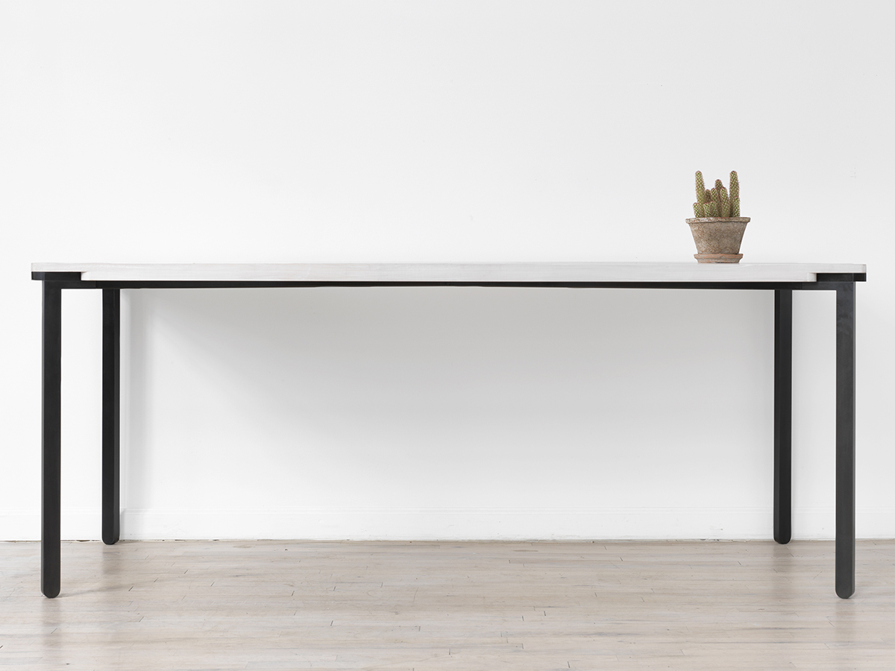
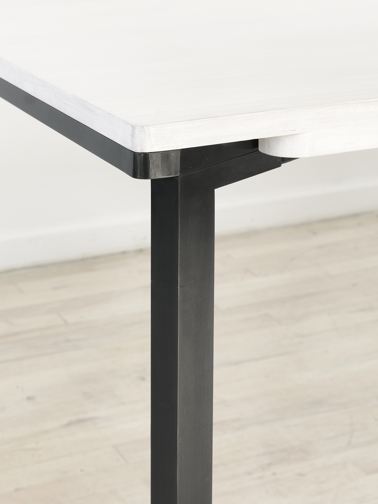
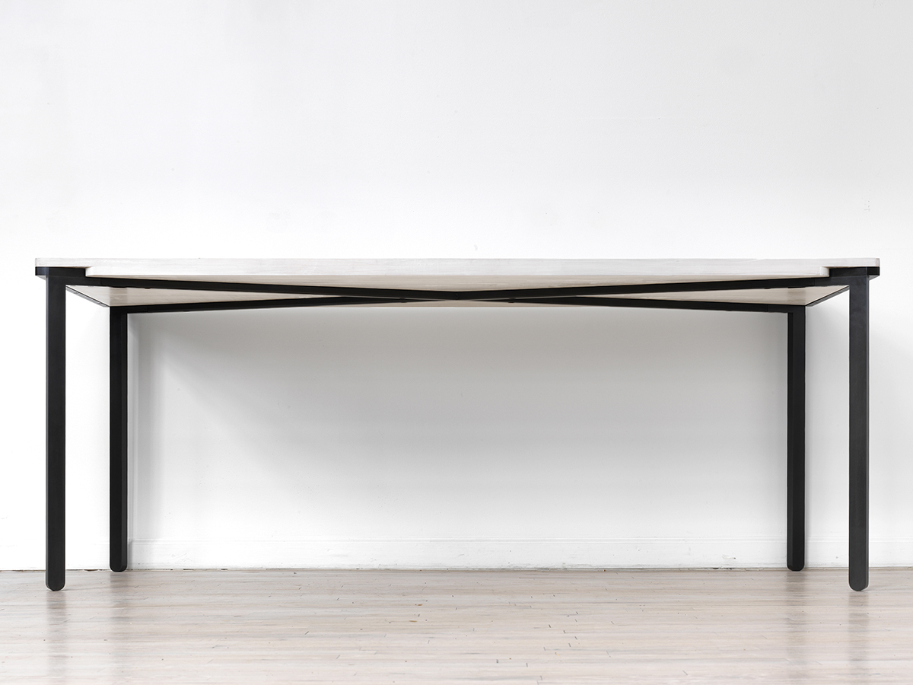
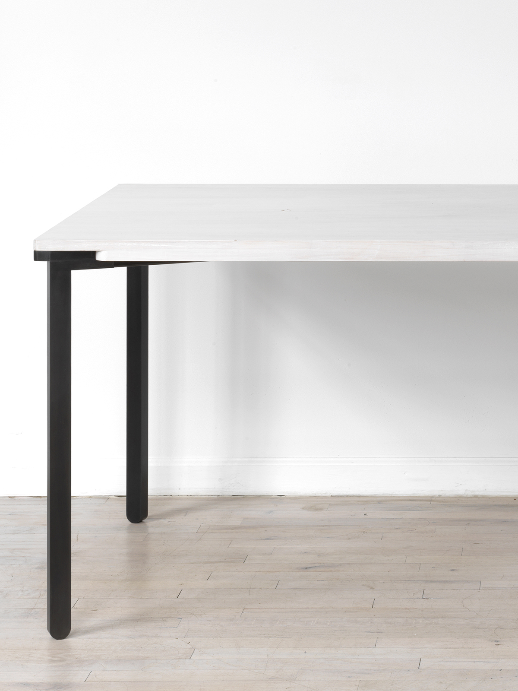

## Bow Tie Table
Viewed from one end, the top and base of the Bow Tie appear to come together in a simple connection of two materials along the same plane. As the viewer turns the corner, an unexpected detail is revealed. The frame disappears into the top, leaving only the suggestion that there is more under the surface.  
  
Made to order in a variety of sizes, materials, and finishes.  
#### [Download Tearsheet](bow-tie-table.pdf?target=_blank)  