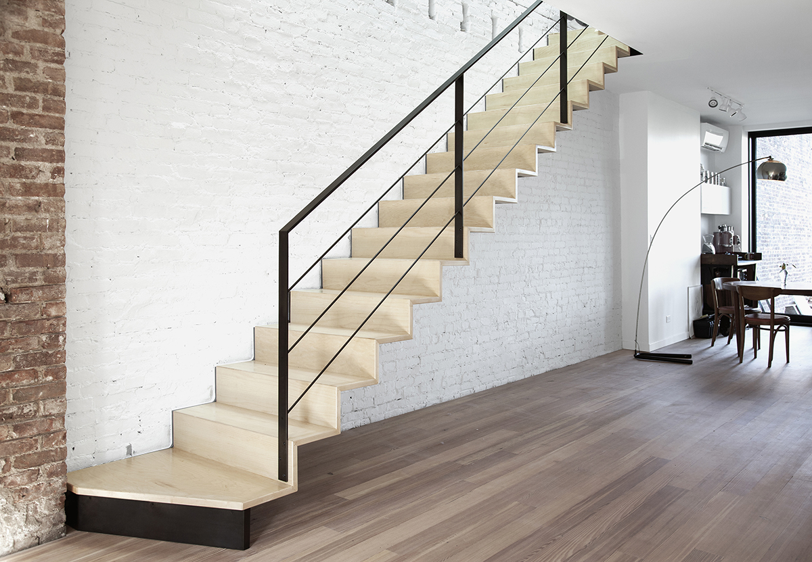
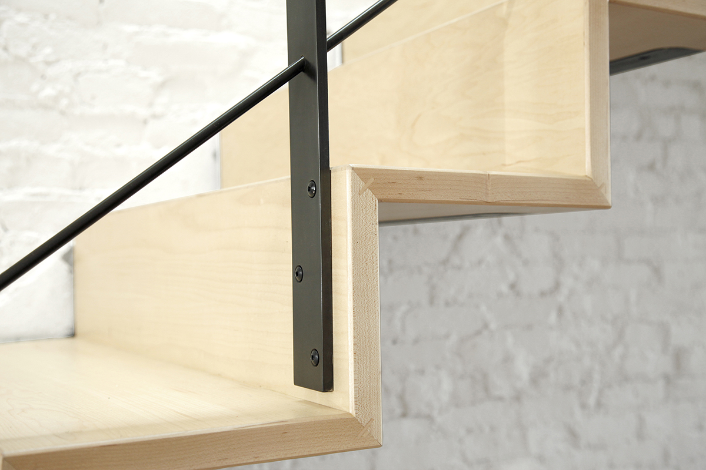
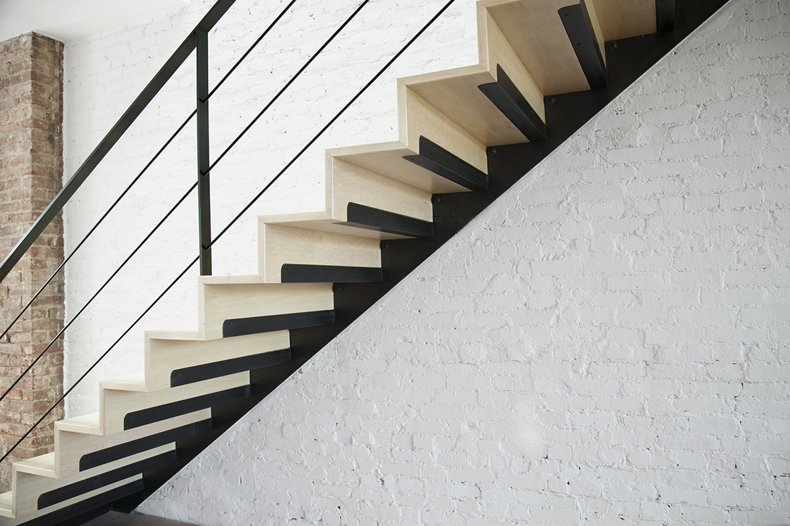
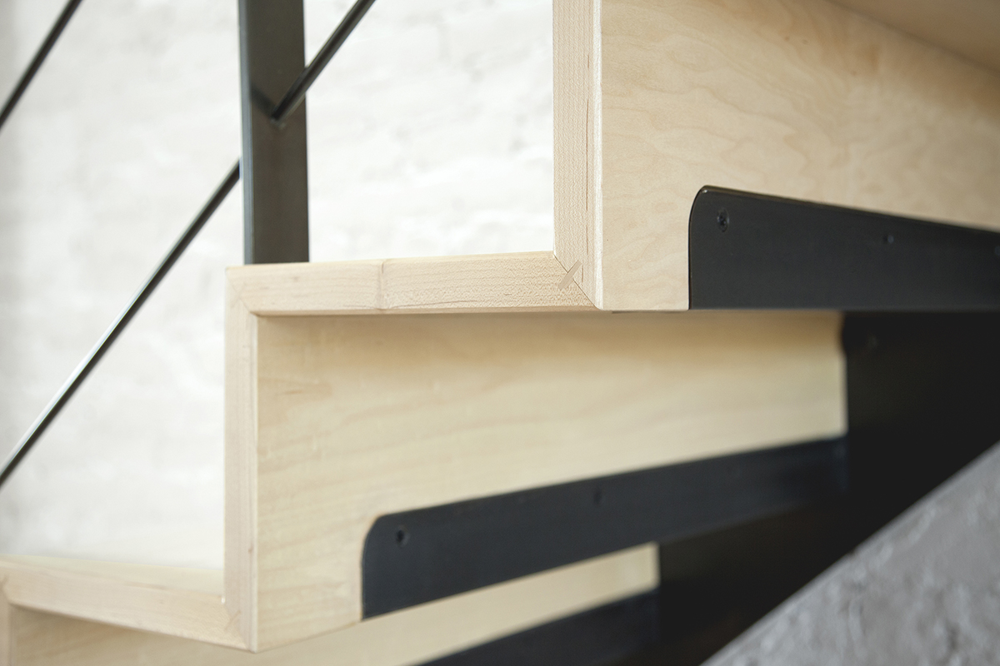
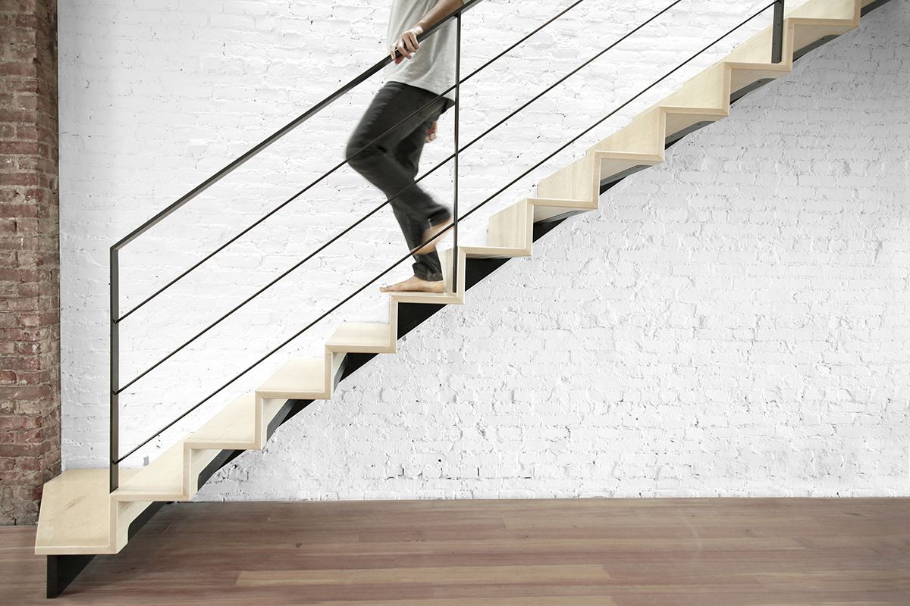
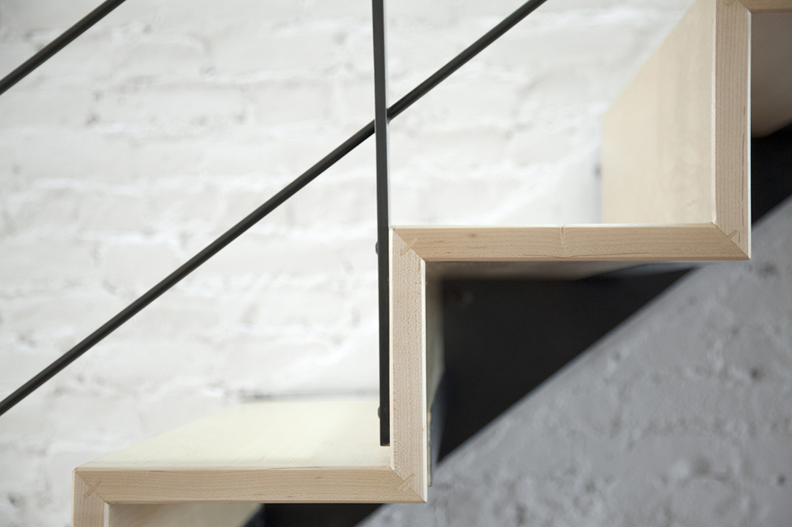

## Floating Stair 1
A delicate wood edge, cantilevered from a single (sawtoothed) steel stringer, creates a continuous line connecting the parlor and second floor. The steel structure, hidden within and behind the stair, allows the thickness of the wood to remain prominent and creates a sense of weightlessness. 

Structural steel with a black oxide patina. Maple tread and riser assembly.