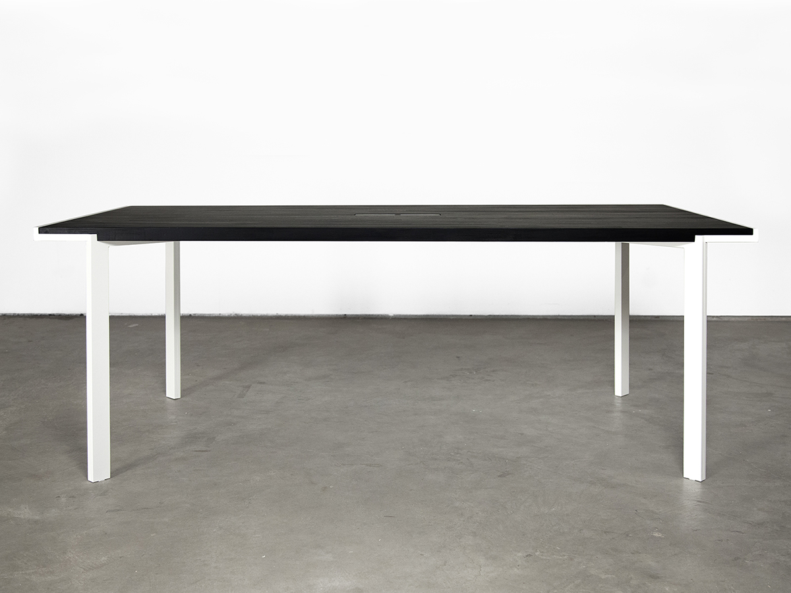
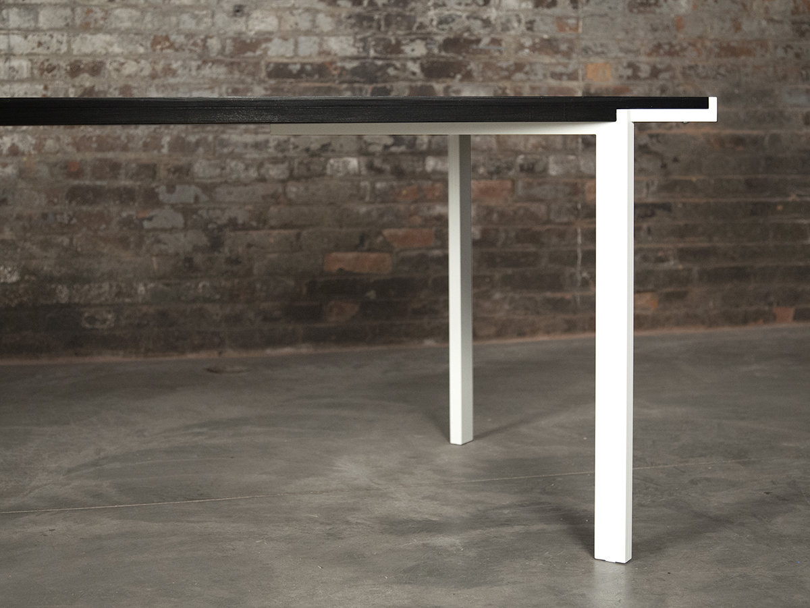
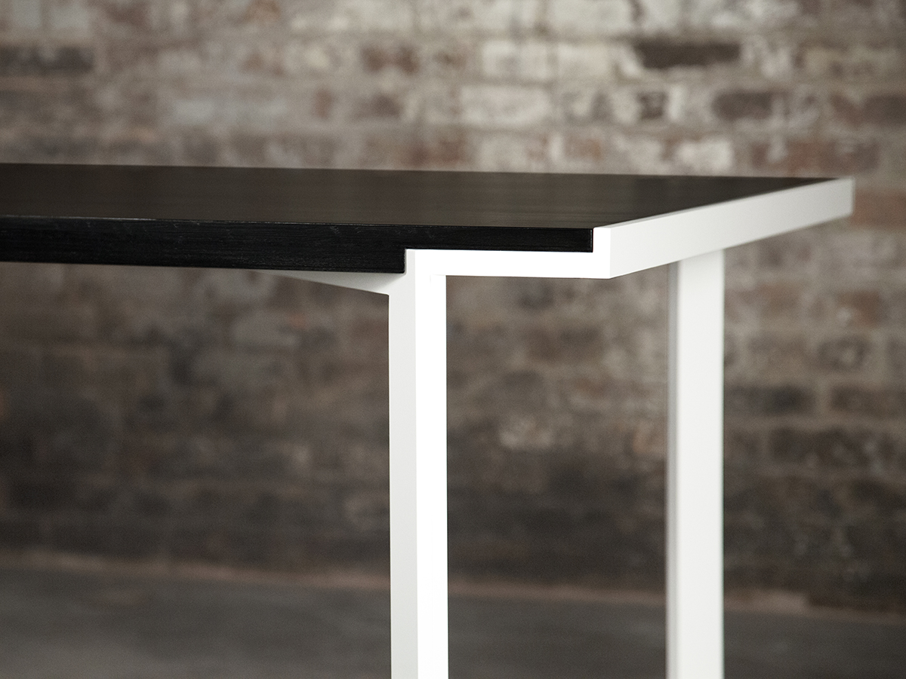
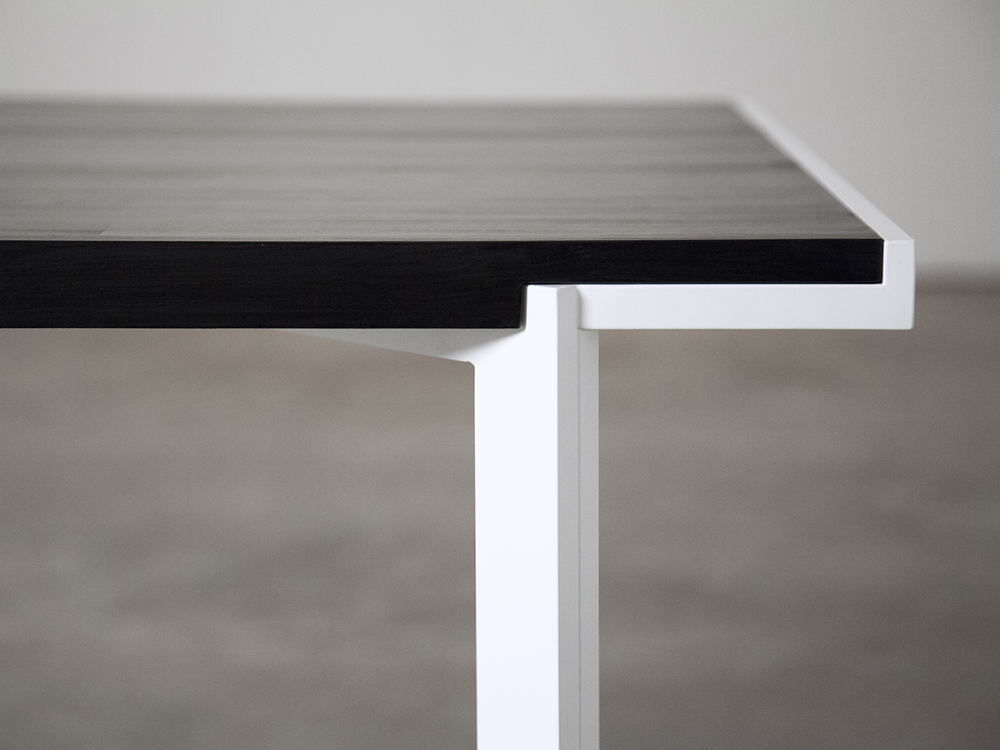

## Trace Table
Through a single, contiguous line, the legs of the Trace Table define the edge, rotating and pivoting each time there is a change in plane. The line is only interrupted by a slight idiosyncrasy, a small triangle peeking out, as the leg transitions to the apron.

Made to order in a variety of sizes, materials, and finishes.  
#### [Download Tearsheet](trace-table.pdf?target=_blank)  