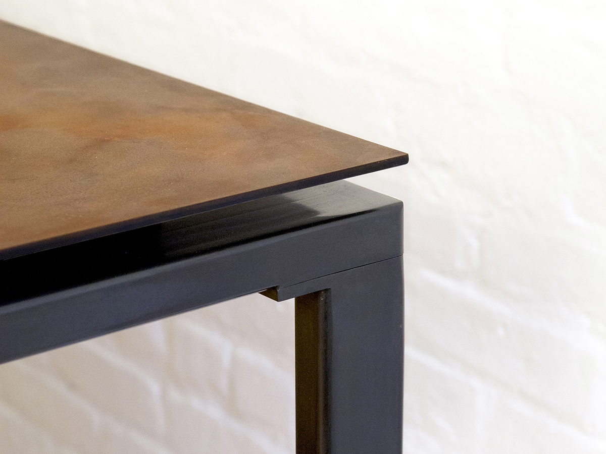
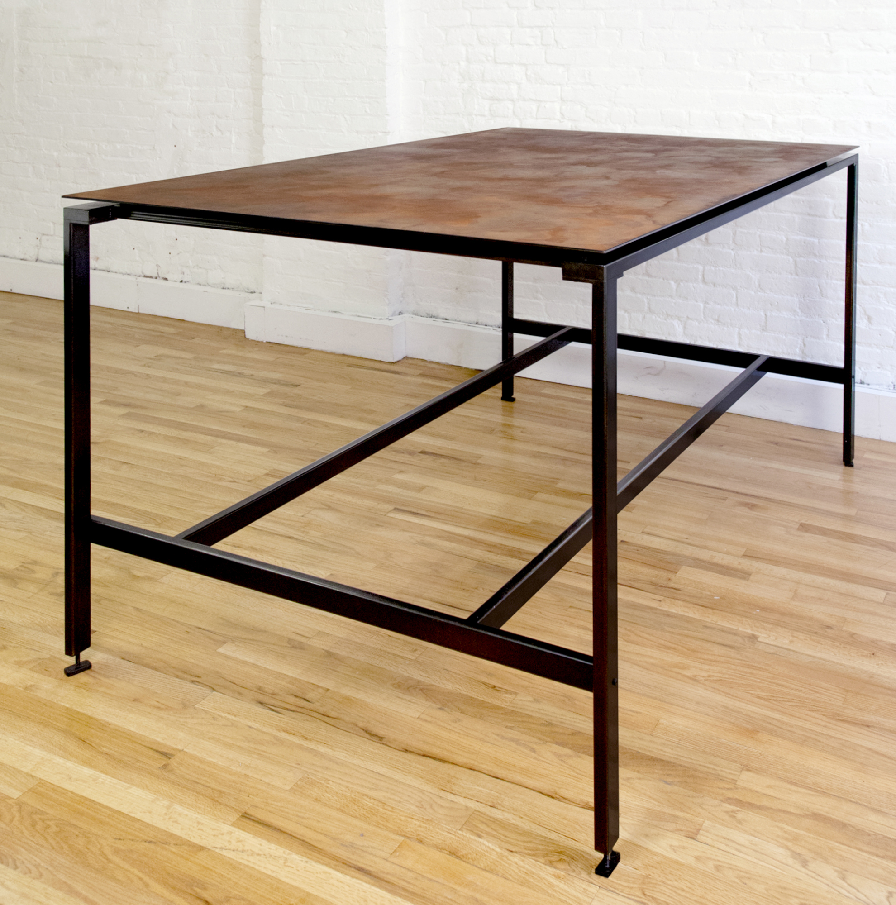
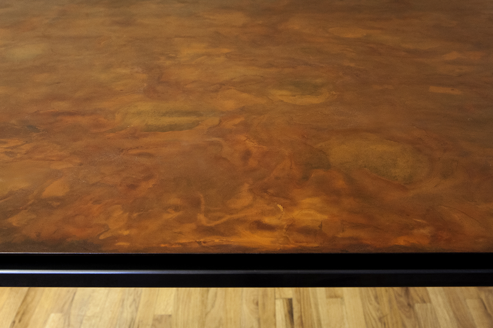

## Oxide Workstation
The Oxide Workstation is distinguished by a single ¼” thick steel plate floating above a blackened base. The work surface has been oxidized to create an undulating, cloud like pattern that lends depth and complexity to the thin material.