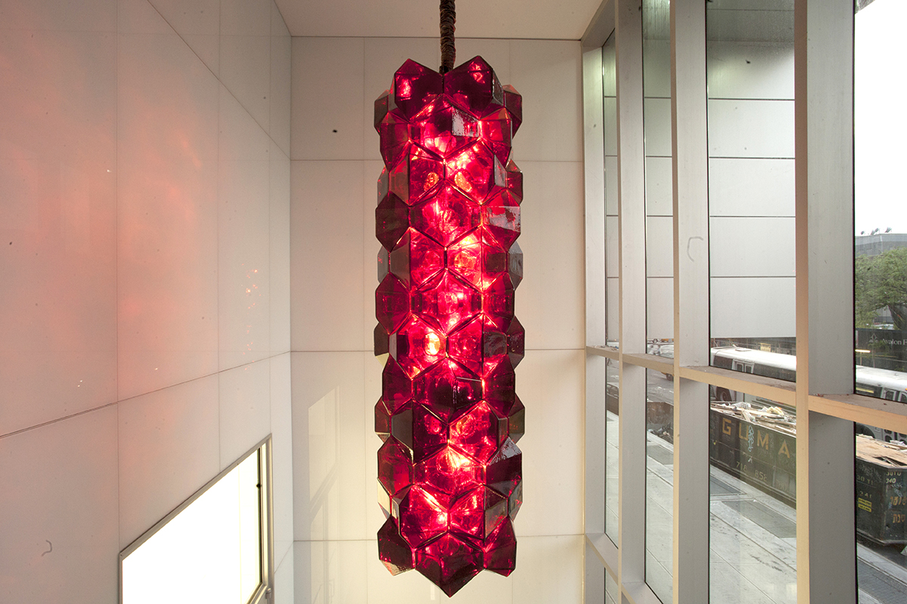
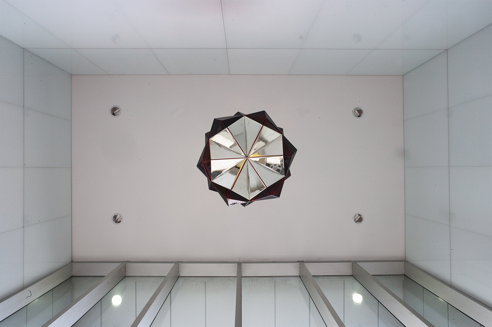
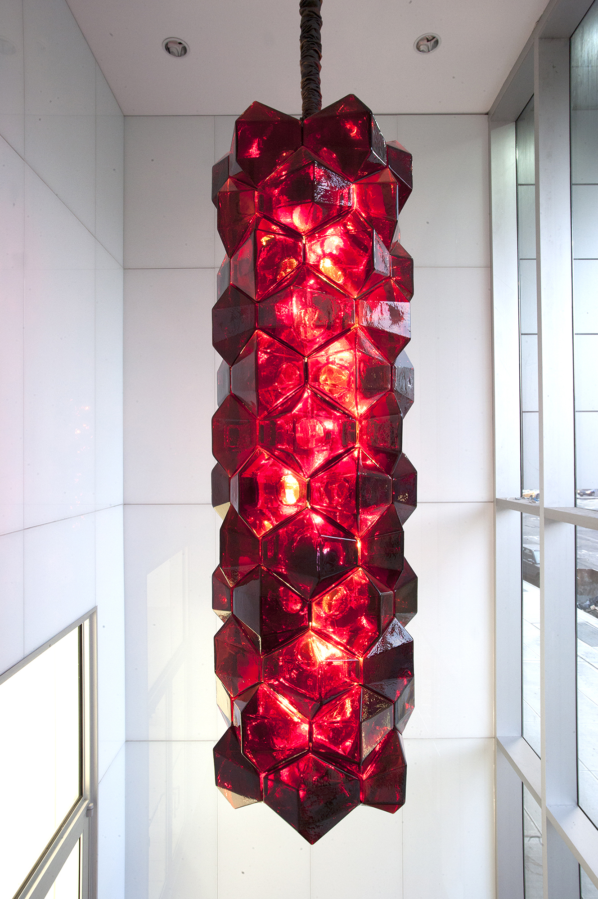
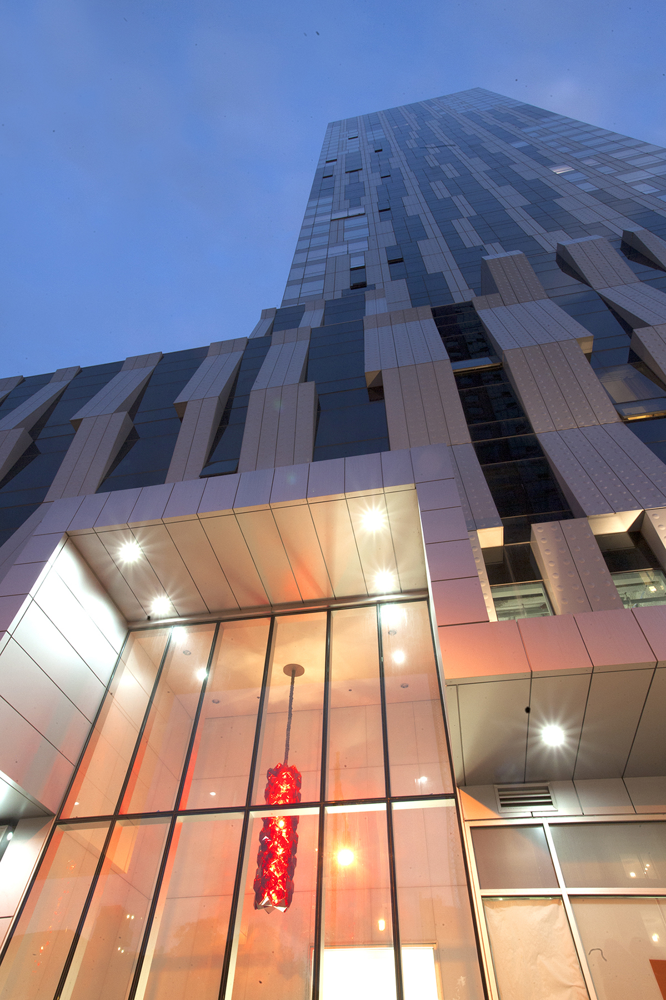

## Pomegranate Light

Interlocking hand blown glass cells form this luminous column of light, inspired by the geometry of a pomegranate seed. Pomegranate combines digital techniques in design, mold, and steel fabrication with the handcraft of blown glass and metal working to create a form that is both tactile and precise. 

In collaboration with PrePost, installed in Toren in downtown Brooklyn, NY.
